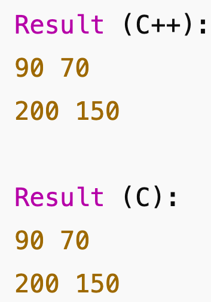

# HW-8-C-vs-C-
##a)AUTHORING
Dua Abdullah, class: CMSC 313 (Mon & Wed 2:30 - 3:45pm), prof. Kid Kidd, Current time: 8:51pm, Date: April 19th 2025. 

##PURPOSE OF SOFTWARE:
Creating an object that will embody matrix functions (additoin, multiplication, matrix mult., transpose). This will be done by writing a C++ and C version. 

##FILES: 
C++ files: 

matrix.hpp: includes function prototypes for matrix addition, scalar multiplication, transposition, and multiplication along with the definition of the Matrix class. It specifies the proper behavior of the matrix object.

matrix.cpp: carries out the member functions of the Matrix class specified in Matrix.hpp. This features object-oriented C++ logic for all supported matrix operations.

main.cpp: A test driver that builds Matrix objects and shows how the matrix class works. It contains more example operations as well as the precise computation of the test equation.

C version: 
matrix.h: includes declarations for functions and the data structures (such as a matrix struct) required for matrix operations in C. serves as the matrix library's interface.

matrix.c: carries out the matrix operations, including addition, scalar multiplication, transposition, and multiplication, specified in matrix.h. uses the C99 standard for procedural programming (as mentioned in assignment).

main.c: The matrix functions from matrix.h and matrix.c are used in this test program. It shows how to solve the test problem and use the C-based matrix library.

##BUILDING INSTRUCTION: 
Run this command to compile: g++ main.cpp Matrix.cpp -o matrix_cpp
Run then using this: ./matrix_cpp

To run C version code files: 
to compile: gcc main.c matrix.c -o matrix_c

To run: ./matrix_c

##TESTING METHODOLOGY: 
To make sure output was correct in both versions and to check if it gives same answer over and over i tested this matrix equ.: D = A + (3 * B) * C^T

##SCREENSHOT: 

 

